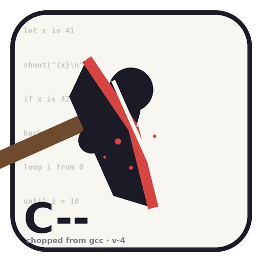

# C-- 🪓

> **C, but with fewer parts.**
> 从 GCC 分支 (fork) 出来的极简主义编译器实验。我们大砍了 C 语言——
> 砍掉分号、砍掉 `for`、砍掉 `==`，然后创造了一些**奇怪的语法**。



---

## 宣传语 (Slogans)

- **「少即是多，砍即是爱。」** — *Less is more. Chopping is love.*
- **「C++ 在加东西，C-- 在做减法。」**
- **「我们删掉了 90% 的 C，剩下的 10% 全是 bug 的快乐。」**
- **「没有分号，没有回头。」** *(No semicolons. No regrets.)*
- **「编译通过 = 程序正确（不保证）。」**
- **「GCC 的孙子，程序员的眼泪。」**

---

## 为什么叫 C--？

C++ 每十年加一百个特性。我们反着来：
每次 release **删除**一批特性。版本号使用递减整数：
`v-3`, `v-4`, `v-5`……数字越小，语言越大。

## 大砍清单 (The Great Chop) ✂️

| 被砍掉的 C 特性 | 替代方案 (更奇怪) |
|---|---|
| `;` 语句结束符 | 换行即结束；想续行用 `\` |
| `for` 循环 | 彻底删除。用 `loop` + `until` |
| `==` / `!=` | `is` / `isnt`（是的，英语关键字）|
| `{ }` 代码块 | 缩进即块（Python 化，但我们拒绝道歉）|
| `int/char/float` | 一律 `num`；类型是社会的建构 |
| `return` | `back`，且必须是函数最后一句，不许说第二遍 |
| 头文件 `#include` | `borrow <stdio>` |
| `NULL` | `nothing`（也可以写作 `∅`，UTF-8 强制）|
| 三元运算符 `?:` | `maybe(a, b, c)` 内置函数 |
| `&&` / `||` | `&also` / `|else&`（对，就是这样）|
| 指针解引用 `*p` | `p^`（读作 p-to-the-power-of-memory）|
| `switch` | `pick ... case ... thunk` |

## 创造的奇怪语法 🌀

```clike
borrow <stdio>

func greet(name is text) -> none:
    shout("hello, {name}!\n")   # shout == printf, 因为要大声

func main() -> num:
    loop i from 0 to 10:
        if i is 7:
            shout("seven is lucky\n")
            skip                 # continue 被砍了
        if i isnt 2 &also i isnt 4:
            shout("{i} odd-ish\n")
    until i > 10               # loop 必须 until 收尾
    back 0
```

- `shout(...)`：唯一 IO 原语，映射到 `printf`。
- `skip` / `halt`：continue / break 的遗孤。
- `->` 返回类型箭头（从 Rust 偷的，我们不生产奇怪，只搬运）。
- 字符串插值 `{expr}`：从 shell 偷的。
- `text` 类型：`const char*` 的艺名。
- 注释只有 `#`。`//` 和 `/* */` 因"过于传统"被处决。

## 工具链

本仓库包含一个参考实现 `src/ccmm.py`（约 600 行），它把 C--
**转译 (transpile)** 成合法 C，再调用系统 `cc` 编译。
这就是"fork GCC 后大砍"的精神继承者——毕竟完整 GCC 有 3000 万行，
我们砍到只剩一根命令行。

### 快速开始

```bash
python3 src/ccmm.py examples/hello.ccm -o hello && ./hello
python3 src/ccmm.py --run examples/fizzbuzz.ccm
```

### 更多例子

见 [`examples/`](examples/) 目录。

## 路线图 (反向)

- [x] v-3: 砍掉分号
- [x] v-4: 砍掉 for 循环
- [ ] v-5: 砍掉 `if`（只留 `unless`）
- [ ] v-6: 砍掉变量赋值（只许初始化，学 Erlang）
- [ ] v-7: 砍掉 main 函数（程序从随机一行开始执行）
- [ ] v-∞: 砍掉 C--

## License

GPL-3.0-or-later（继承自 GCC 祖先，详见 `LICENSE`）。
砍伐行为请勿在家中植物上模仿。
